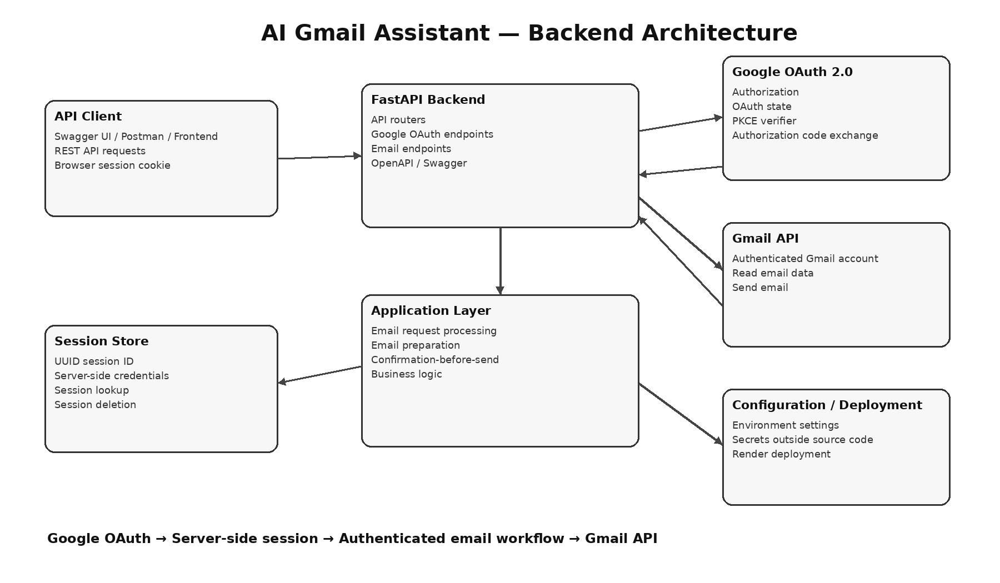

# AI Gmail Assistant — Backend

## 1. Project Introduction

**AI Gmail Assistant** is a backend-focused application that connects an AI-powered email workflow with Gmail through the Gmail API.

The backend is built with **FastAPI** and uses **Google OAuth 2.0** for Gmail authorization. After authentication, the server creates an application session and associates the authenticated Google credentials with that session.

The backend exposes REST APIs for preparing and sending emails while separating API handling, application logic, authentication, and infrastructure concerns.

### Core flow

```text
User / API Client
      ↓
Google OAuth
      ↓
FastAPI Authentication
      ↓
Server-side Session
      ↓
Email Processing
      ↓
Gmail API
```

The backend can be used independently through Swagger/OpenAPI, Postman, or a separate frontend.

---

## 2. Key Features

- Google OAuth 2.0 authentication
- PKCE-based OAuth flow
- OAuth state validation
- Gmail API integration
- Server-side session management
- HTTP-only session cookie
- Authenticated email preparation
- Explicit confirmation before sending
- REST APIs
- Swagger/OpenAPI documentation
- Environment-based configuration
- Cloud deployment support

---

## 3. Functional Requirements

### Authentication

The system should:

1. Start Google OAuth authentication.
2. Redirect the user to Google's authorization page.
3. Validate OAuth state on callback.
4. Reuse the PKCE verifier.
5. Exchange the authorization code for Google credentials.
6. Verify the authenticated Gmail account.
7. Create an application session.
8. Store credentials against the session ID.
9. Set the session ID as an HTTP-only cookie.

### Email Workflow

The system should:

1. Accept an email request.
2. Authenticate the request through the server-side session.
3. Process the request through the email workflow.
4. Prepare an email draft.
5. Require explicit confirmation before sending.
6. Send the confirmed email through Gmail API.

---

## 4. Non-Functional Requirements

### Security

- Never hard-code secrets or API keys.
- Keep OAuth credentials on the backend.
- Generate session IDs server-side.
- Use an HTTP-only session cookie.
- Validate OAuth state before exchanging authorization codes.
- Store secrets in environment variables.

### Reliability

- Missing sessions return HTTP 401.
- Invalid sessions return HTTP 401.
- Invalid OAuth state is rejected.
- Email sending requires explicit confirmation.

### Maintainability

The backend separates:

```text
API Layer
Application Layer
Infrastructure Layer
Configuration
```

This keeps HTTP concerns, business logic, authentication, and external integrations independent.

### Scalability Note

The current session store is in-memory. This is suitable for development and a single backend instance. A multi-instance production deployment should use a shared store such as Redis or a database.

---

## 5. Technical Requirements

### Runtime

- Python 3.x
- FastAPI
- Uvicorn

### Google Integration

- Google OAuth 2.0
- PKCE
- Gmail API
- `google-auth`
- `google-auth-oauthlib`
- `google-api-python-client`

### Backend

- FastAPI REST APIs
- Pydantic schemas
- Cookie-based session authentication
- UUID session identifiers
- Environment-based configuration

### Documentation

FastAPI provides:

```text
/docs
/openapi.json
```

Swagger UI can be used to interactively test the APIs.

### Deployment

The backend can be deployed to Render or another compatible Python hosting platform.

---

## 6. Architecture



### High-level architecture

```text
API Client
    ↓
FastAPI
    ↓
Authentication / Email Routers
    ↓
Application Layer
    ↓
Session Store + Gmail Integration
    ↓
Google Gmail API
```

---

## 7. Project Structure

The backend follows a layered structure similar to:

```text
project/
│
├── app/
│   ├── api/
│   │   ├── routers/
│   │   └── schemas/
│   │
│   ├── application/
│   │   └── email_flow/
│   │
│   ├── infrastructure/
│   │   └── auth/
│   │       └── session_store.py
│   │
│   └── config/
│       └── settings.py
│
├── requirements.txt
└── ...
```

The exact directory structure should follow the repository.

---

## 8. API Endpoints

### Google Login

```http
GET /auth/google
```

Starts the Google OAuth flow.

### Google Callback

```http
GET /auth/google/callback
```

Completes OAuth authentication, creates the application session, and establishes the browser session.

### Prepare Email

```http
POST /email/prepare
```

Example:

```json
{
  "query": "Send an email to John saying I will join the meeting at 3 PM"
}
```

### Send Email

```http
POST /email/send
```

Sends an email after explicit confirmation.

### Health

```http
GET /health
```

Checks whether the backend is running.

---

## 9. Authentication Flow

```text
1. Client requests /auth/google
              ↓
2. Backend creates OAuth state + PKCE verifier
              ↓
3. User authenticates with Google
              ↓
4. Google redirects to /auth/google/callback
              ↓
5. Backend validates OAuth state
              ↓
6. Backend exchanges authorization code
              ↓
7. Gmail credentials are obtained
              ↓
8. Backend creates UUID session
              ↓
9. Credentials are stored against session ID
              ↓
10. HTTP-only session_id cookie is created
              ↓
11. Authenticated API requests use the session
```

---

## 10. Local Setup

### Step 1 — Clone

```bash
git clone <repository-url>
cd <project-directory>
```

### Step 2 — Create virtual environment

Windows:

```bash
python -m venv venv
venv\Scripts\activate
```

Linux/macOS:

```bash
python3 -m venv venv
source venv/bin/activate
```

### Step 3 — Install dependencies

```bash
pip install -r requirements.txt
```

### Step 4 — Configure environment

Create the required `.env` file.

Example local configuration:

```env
GOOGLE_REDIRECT_URI=http://127.0.0.1:8000/auth/google/callback
FRONTEND_URL=http://127.0.0.1:8000/docs
```

Add any other variables required by the project's configuration.

### Step 5 — Configure Google OAuth

Create/configure the Google Cloud OAuth client and Gmail API.

Place the client configuration where the application expects it.

**Never commit OAuth secrets, `.env`, API keys, or tokens to GitHub.**

### Step 6 — Start FastAPI

Depending on the project's entry point:

```bash
uvicorn app.main:app --reload
```

### Step 7 — Open Swagger

```text
http://127.0.0.1:8000/docs
```

### Step 8 — Authenticate

Open:

```text
http://127.0.0.1:8000/auth/google
```

Complete Google authentication.

### Step 9 — Test APIs

Use Swagger to test:

```text
POST /email/prepare
POST /email/send
```

---

## 11. Deployment

A typical Render configuration is:

### Build command

```bash
pip install -r requirements.txt
```

### Start command

```bash
uvicorn app.main:app --host 0.0.0.0 --port $PORT
```

Configure production environment variables through Render rather than committing secrets to the repository.

The production Google OAuth redirect URI must exactly match the callback URI configured in Google Cloud.

---

## 12. Technology Overview

| Technology | Purpose |
|---|---|
| Python | Backend language |
| FastAPI | REST API framework |
| Uvicorn | ASGI server |
| Google OAuth 2.0 | Authentication and Gmail authorization |
| PKCE | OAuth authorization-code protection |
| Gmail API | Gmail read/send integration |
| Pydantic | Request/response validation |
| UUID | Session identifiers |
| HTTP Cookies | Browser session transport |
| Swagger/OpenAPI | API documentation and testing |
| Render | Cloud deployment |

---

## 13. Design Principles

### Separation of Concerns

API routes handle HTTP concerns, application services handle business logic, and infrastructure components handle external systems.

### Explicit Confirmation

The system does not send an email simply because a draft was generated. Sending requires explicit confirmation.

### Server-Side Credential Handling

Google credentials remain on the backend and are associated with the application session.

### Environment-Based Configuration

Deployment-specific configuration and secrets are kept outside the source code.

---

## 14. Testing

The backend can be tested using:

- Swagger UI
- Postman
- Browser requests
- A separate frontend

Swagger:

```text
/docs
```

OpenAPI:

```text
/openapi.json
```

---

## 15. Future Improvements

- Redis/database-backed sessions
- Session expiration
- Token refresh and persistence
- Automated tests
- Structured logging
- Rate limiting
- Monitoring and observability
- CI/CD
- Dedicated secret management
- More advanced AI email workflows

---

## 16. Project Summary

This project demonstrates a backend architecture for an AI-powered Gmail assistant using **FastAPI, Google OAuth 2.0, Gmail API, and server-side session management**.

It combines secure authentication, API design, business-logic separation, email workflow control, and cloud deployment into a backend that can independently serve Swagger, Postman, or any future frontend client.
